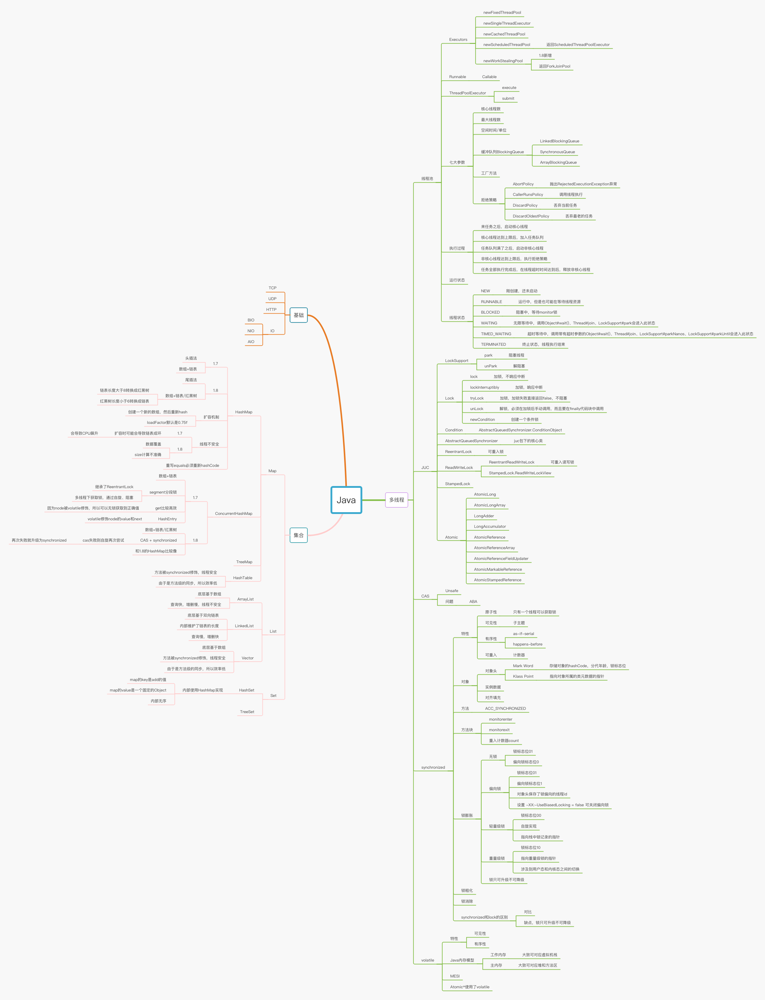

# Java 篇

首先，看一下Java的知识图谱。

## 基础

1. Object有哪些方法？
2. == 和 equals 的区别是什么？
3. 为什么重写equals()方法就必须重写hashCode()方法？
4. 两个对象的 hashCode()相同，则 equals()也一定为 true，对吗？ 
5. final 在 java 中有什么作用？ static呢？
6. final、finalize 和 finally 的不同之处？ 
7. java 中操作字符串都有哪些类？它们之间有什么区别？ 
8. String str="i"与 String str=new String("i")一样吗？ 
9. 如何将字符串反转？ 
10. 能不能讲一下 int 的拆箱和装箱？
11. 抽象类和接口有什么区别？
12. 普通类和抽象类有哪些区别？ 
13. 抽象类一定要有抽象方法吗？
14. 抽象类能使用 final 修饰吗？ 
15. java 中 IO 流分为几种？
16. 代理了解吗？什么是静态代理？什么是动态代理？

## 集合

1. Java中有哪些集合？
2. Collection 和 Collections 有什么区别？ 
3. List、Set、Map 之间的区别是什么？ 
4. HashMap 和 Hashtable 有什么区别？ 
5. 如何决定使用 HashMap 还是 TreeMap？ 
6. Java 中的 TreeMap 是采用什么树实现的？ 
7. 说一下 HashMap 的实现原理？ 扩容机制了解吗？为什么说它不是线程安全的？如果要线程安全应该用什么？
8. 说一下 ConcurrentHashMap 的实现原理？
9. 说一下 HashSet 的实现原理？它和 HashMap 有什么区别？它是如何检查重复的？
10. ArrayList 和 LinkedList 的区别是什么？ 
11. 如何实现数组和 List 之间的转换？ 
12. ArrayList 和 Vector 的区别是什么？ 
13. Array 和 ArrayList 有何区别？ 
14. 在 Queue 中 poll()和 remove()有什么区别？ 
15. 哪些集合类是线程安全的？ 
16. 迭代器 Iterator 是什么？ 
17. Iterator 怎么使用？有什么特点？ 
18. Iterator 和 ListIterator 有什么区别？ 
19. Java 中 LinkedHashMap 和 PriorityQueue 的区别是什么？ 

## 多线程

1. 用过线程池吗？为什么要用线程池？几个参数是怎么设置的？拒绝策略是什么？为什么不建议使用Executors工厂类？
2. 线程有几种状态？
3.  Runnable()和Callable()的区别？
4. Thread的run()和start()方法有什么区别？
5. 为什么我们调用start()方法时会执行run()方法，为什么我们不能直接调用run()方法？ 
6. 有哪些办法可以让一个线程阻塞？
7. Java中你怎样唤醒一个阻塞的线程？ 
8. 在java中wait()和sleep()方法的不同？ 
9. 为什么wait()方法和notify()/notifyAll()方法要在同步块中被调用 ？
10. 现在有T1、T2、T3三个线程，你怎样保证T2在T1执行完后执行，T3在T2执行完后执行？ 
11. 用Java实现一个阻塞队列
12. ThreadLocal 有用过吗？他是如何实现同一个线程共享变量的？子线程能拿到父线程设置的值吗？如果我想拿到该怎么做？
13. volatile 了解吗？它线程安全吗？为什么不安全？为什么不能保证原子性？它是如何保证可见性、有序性的？
14. synchronized 了解吗？在方法上、代码块内、静态变量上加 synchronized 有什么区别？底层是怎么实现的？jdk 1.6之后做了哪些锁优化？
15. 使用 synchronized 如何实现单缓冲区的生产者消费者模型？
16. Java中有哪几种锁？
17. synchronized 和 ReentrantLock 有什么区别？
18. [说一下 ReentrantLock 的实现原理？它是公平锁吗？可重入吗？](../java/ReentrantLock.md)
19. 在Java中，Lock接口相比于synchronized，优势是什么？
20. 你需要实现一个高效的缓存，它允许多个用户读，但只允许一个用户写，以此来保持它的完整性，你会怎样去实现它？ 
21. [说一下 ReentrantReadWriteLock 的实现原理？它是公平锁吗？可重入吗？](../java/ReentrantReadWriteLock.md)
22. 什么是CAS？什么是ABA问题？
23. FutureTask是什么？
24. 为什么会发生死锁，你能制造一个死锁吗？
25. 什么是原子操作，Java中的原子操作是什么？ 
26. 什么是竞争条件？你怎样发现和解决竞争？ 
27. CycliBarriar和CountdownLatch有什么区别？ 
28. 什么是不可变对象，它对写并发应用有什么帮助？ 
29. 你在多线程环境中遇到的问题是什么？你是怎么解决它的？ 

## 其他

1. 线程与进程的区别？
2. 你了解守护线程吗？它和非守护线程有什么区别 
3. 什么是多线程中的上下文切换？
4. 死锁与活锁的区别，死锁与饥饿的区别？
5. Java中用到的线程调度算法是什么？
   1. 抢占式调度策略
   2. 时间片轮转调度算法
6. 在Java中什么是线程调度？
7. 在线程中你怎么处理不可捕捉异常？
8. jdk 8的新特性有哪些？