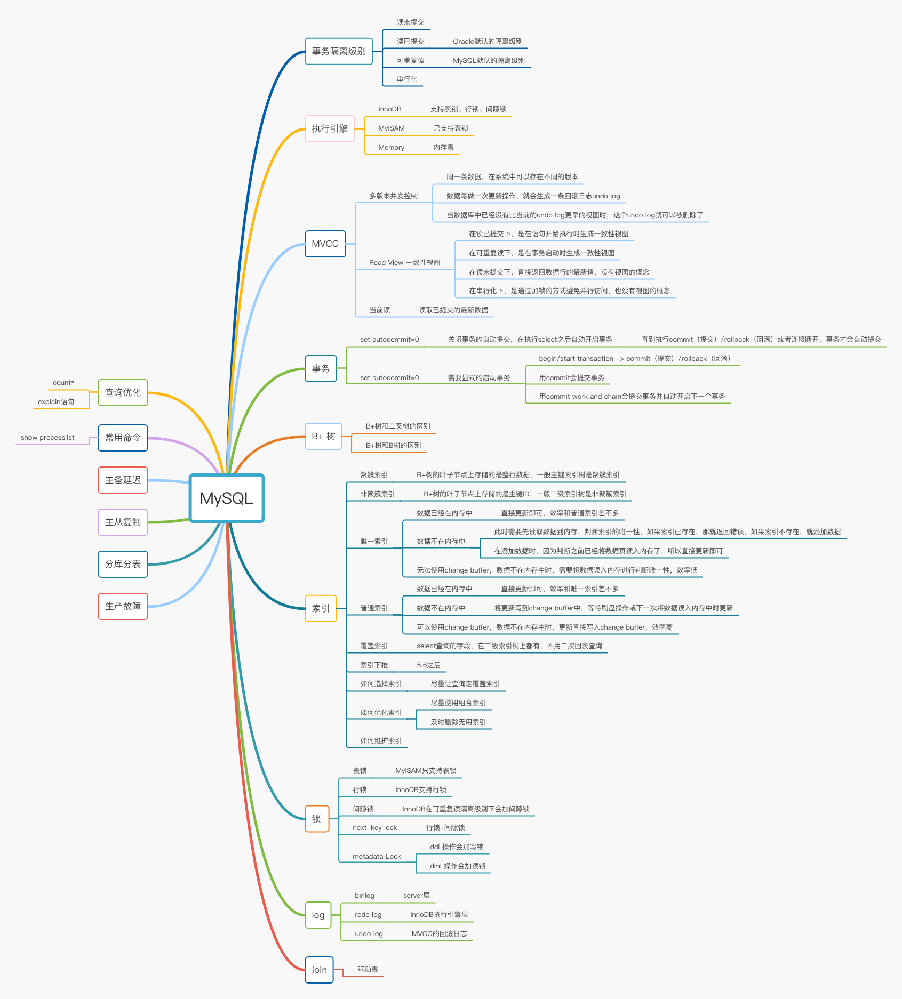

# MySQL 篇

首先, 看一下MySQL的知识图谱。

## 面试问题连环炮

1. 数据库的三范式了解吗? 
   1. 第一范式: 列不可再分, 
   2. 第二范式: 行可以唯一区分, 主键约束, 
   3. 第三范式: 表的非主属性不能依赖与其他表的非主属性, 外键约束, 
   4. 三大范式是一级一级依赖的, 第二范式建立在第一范式上, 第三范式建立第一第二范式上。 
2. 事务了解吗? 事务有哪些特性? 
3. MySQL 的结构了解吗? 
4. MySQL 有哪些存储引擎? 
   1. InnoDB
   2. MyISAM
   3. Memory
5. MySQL 有哪些隔离级别? 
   - 读未提交
   - 读已提交(RC)
   - 可重复读(RR)
   - 串行化
6. MySQL 中有哪些锁? 
   1. MDL锁（dml操作会加读锁, ddl操作会加写锁）
   2. 表锁
   3. 行锁(Record Lock)
   4. 间隙锁(Gap Lock)
   5. Next-key Lock(Record Lock + Gap Lock)
7. 什么是聚簇索引? 什么是非聚簇索引? 
8. 唯一索引和普通索引的区别? 
9. MySQL 的数据是如何存储的? InnoDB为什么选用B+树而不是二叉树? 
10. 你们的生产环境用的什么隔离级别? 为什么用? rc 和 rr有什么区别? 
11. 能不能说一下 MySQL 的 MVCC? 
    1. mvcc, 多版本并发控制
12. count (1), count (*)和count(id)的区别? 

## 场景分析

1. 做过哪些SQL优化? 怎么做的? 
2. 如果有一个很大的表, 想要优化它的查询, 你有什么思路? 