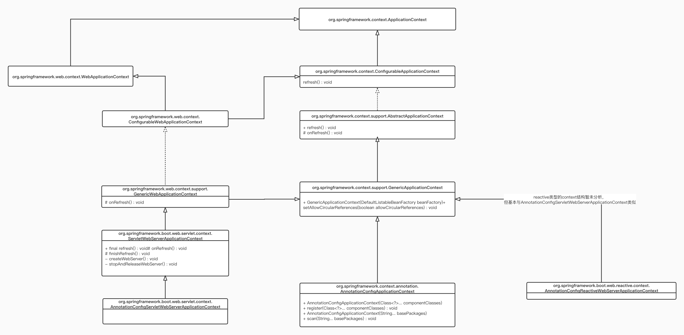
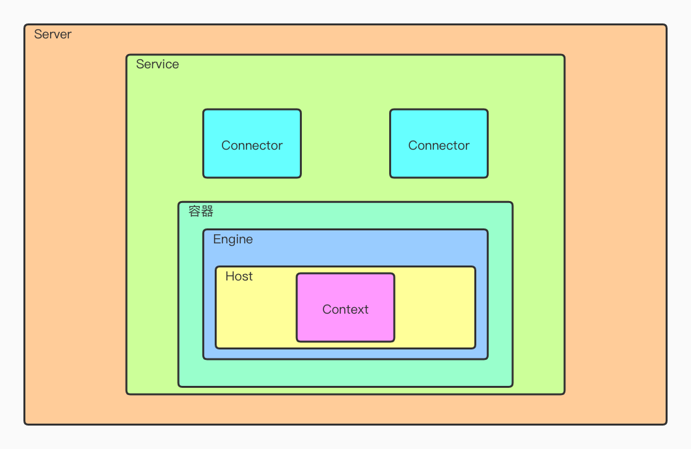
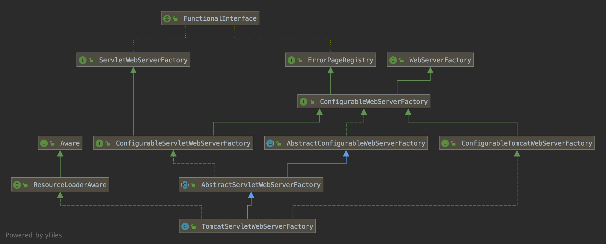
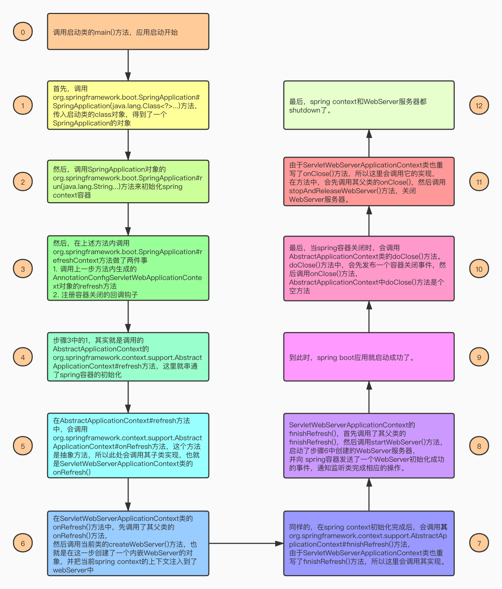

# Spring Boot 启动流程

**OK，废话不多说，今天我们来聊一下，spring boot的启动流程。**

## 问题

1. spring boot如何初始化spring容器的？
2. spring boot如何启动内嵌的web服务器的？

## 思考

**首先，先思考下，一个普通的spring项目是如何变成一个web服务。**

1. 要有一个spring的web应用。
2. 要有一个web应用服务器，比如说Tomcat。
3. 将这个spring应用打war包，放入web容器中，执行start.sh脚本，启动web容器。

**然后，再猜测下，spring boot要怎么做，才能做到一个启动类完成上述3个步骤。**

1. 标注当前应用是一个web应用。
2. 启动spring容器。
3. 启动内嵌的web应用服务器，比如说Tomcat。

**OK，那下面，就带着问题和猜测，去翻一下spring boot的源码，看看它到底是如何启动的。**

## 源码分析

1. 首先，在每一个spring boot的启动类中，都可以看到这样一段代码。

   ```java
   public static void main(String[] args) {
           SpringApplication.run(DemoApplication.class, args);
       }
   ```

2. 点击进入SpringApplication类，可以看到，在这个类中，定义了三个常量，分别对应三种不同的ApplicationContext的实现类，这三个常量，在后面初始化content容器的时候，会使用到。

   ```java
     /**
   	 * The class name of application context that will be used by default for non-web
   	 * environments.
   	 */
   // 创建一个普通的Spring应用，使用AnnotationConfigApplicationContext
   	public static final String DEFAULT_CONTEXT_CLASS = "org.springframework.context."
   			+ "annotation.AnnotationConfigApplicationContext";
   
   	/**
   	 * The class name of application context that will be used by default for web
   	 * environments.
   	 */
   // 创建一个Spring web应用，使用AnnotationConfigServletWebServerApplicationContext
   	public static final String DEFAULT_SERVLET_WEB_CONTEXT_CLASS = "org.springframework.boot."
   			+ "web.servlet.context.AnnotationConfigServletWebServerApplicationContext";
   
   	/**
   	 * The class name of application context that will be used by default for reactive web
   	 * environments.
   	 */
   // 创建一个响应式的Spring web应用，使用AnnotationConfigReactiveWebServerApplicationContext
   	public static final String DEFAULT_REACTIVE_WEB_CONTEXT_CLASS = "org.springframework."
   			+ "boot.web.reactive.context.AnnotationConfigReactiveWebServerApplicationContext";
   ```

3. 接下来，看一下run()方法，在SpringApplication中，run()方法重载了两次。

   ```java
     
     // run()方法第二次重载，这里，也就是给spring boot启动类调用的run()方法，是个空壳方法，把传入的class对象放到了数组中，然后紧接着调用了下方第一次重载的run()方法。
   	public static ConfigurableApplicationContext run(Class<?> primarySource, String... args) {
   		return run(new Class<?>[] { primarySource }, args);
   	}
     // run()方法第一次重载，根据传入的class数组，初始化了一个SpringApplication对象。
   	public static ConfigurableApplicationContext run(Class<?>[] primarySources, String[] args) {
   		return new SpringApplication(primarySources).run(args);
   	}
   ```

4. 接下来，查看SpringApplication的构造方法，先关注两点：

   1. primarySources这个集合被初始化了，并且放入了启动类的class对象。
   2. webApplicationType这个参数被赋值了。

   ```java
     // 空壳方法，resourceLoader参数给了null值
   	public SpringApplication(Class<?>... primarySources) {
   		this(null, primarySources);
   	}
   
   	@SuppressWarnings({ "unchecked", "rawtypes" })
   	public SpringApplication(ResourceLoader resourceLoader, Class<?>... primarySources) {
       // 此时，这里的resourceLoader是空的，记住，下面的启动流程会对它进行初始化
   		this.resourceLoader = resourceLoader;
   		Assert.notNull(primarySources, "PrimarySources must not be null");
       // 1. 将启动类的class对象添加到了primarySources这个set集合中
   		this.primarySources = new LinkedHashSet<>(Arrays.asList(primarySources));
       // 2. 这里，调用WebApplicationType.deduceFromClasspath()进行判断，当前正在启动的应用是一个什么类型的应用，有三种情况：NONE，SERVLET，REACTIVE
   		this.webApplicationType = WebApplicationType.deduceFromClasspath();
       
       // 3. 下面三行代码，还没分析，不影响主流程的执行，暂时放个TODO
   		setInitializers((Collection) getSpringFactoriesInstances(ApplicationContextInitializer.class));
   		setListeners((Collection) getSpringFactoriesInstances(ApplicationListener.class));
   		this.mainApplicationClass = deduceMainApplicationClass();
   	}
   ```

5. 得到SpringApplication的一个对象后，来执行真正的run()方法。

   ```java
     /**
   	 * Run the Spring application, creating and refreshing a new
   	 * {@link ApplicationContext}.
   	 * @param args the application arguments (usually passed from a Java main method)
   	 * @return a running {@link ApplicationContext}
   	 */
     // 原始run()方法
   	public ConfigurableApplicationContext run(String... args) {
   		StopWatch stopWatch = new StopWatch();
   		stopWatch.start();
   		ConfigurableApplicationContext context = null;
   		Collection<SpringBootExceptionReporter> exceptionReporters = new ArrayList<>();
   		configureHeadlessProperty();
       // 创建一个SpringApplicationRunListeners的对象，对象中有一个集合，存放了一组监听器，在这一步，创建成功后，集合中只有一个监听器：org.springframework.boot.context.event.EventPublishingRunListener
   		SpringApplicationRunListeners listeners = getRunListeners(args);
       // 启动集合中的所有监听器
   		listeners.starting();
   		try {
   			ApplicationArguments applicationArguments = new DefaultApplicationArguments(args);
   			ConfigurableEnvironment environment = prepareEnvironment(listeners, applicationArguments);
   			configureIgnoreBeanInfo(environment);
   			Banner printedBanner = printBanner(environment);
         // 上面的这几行代码，猜测应该是初始化运行环境，没有详细去看，但不影响分析主流程，留个TODO
         // 到这里，关键来了，调用createApplicationContext()方法初始化context上下文，先拉到下面先分析下这个方法。
         // 分析完成后，可以得知，在这里，context会被赋值，
         // 启动的是一个默认web服务器spring boot应用，那context就会成为一个AnnotationConfigServletWebServerApplicationContext对象
   			context = createApplicationContext();
         // 得到一组异常分析的类
   			exceptionReporters = getSpringFactoriesInstances(SpringBootExceptionReporter.class,
   					new Class[] { ConfigurableApplicationContext.class }, context);
         // 准备context上下文，留个TODO
   			prepareContext(context, environment, listeners, applicationArguments, printedBanner);
   			// 重中之重！！！关键方法来了，拉到下面，直接分析refreshContext(context)方法
         refreshContext(context);
   			afterRefresh(context, applicationArguments);
   			stopWatch.stop();
   			if (this.logStartupInfo) {
   				new StartupInfoLogger(this.mainApplicationClass).logStarted(getApplicationLog(), stopWatch);
   			}
   			listeners.started(context);
   			callRunners(context, applicationArguments);
   		}
   		catch (Throwable ex) {
   			handleRunFailure(context, ex, exceptionReporters, listeners);
   			throw new IllegalStateException(ex);
   		}
   
   		try {
   			listeners.running(context);
   		}
   		catch (Throwable ex) {
   			handleRunFailure(context, ex, exceptionReporters, null);
   			throw new IllegalStateException(ex);
   		}
   		return context;
   	}
   
     // 这个方法很简单，一个switch，根据上文提到的webApplicationType去获取一个contextClass对象，获取的对象也是在类头部的三个常量（contextClass的全限定名）
     // 到这，就可以回答第一个猜测了，spring boot如何标记当前应用是一个spring web应用？
     // 通过判断webApplicationType的值，来获取对应的context上下文
     // SERVLET: 创建一个Spring web应用
     // REACTIVE: 创建一个响应式的Spring web应用
     // NONE: 创建一个普通的Spring应用
     protected ConfigurableApplicationContext createApplicationContext() {
   		Class<?> contextClass = this.applicationContextClass;
   		if (contextClass == null) {
   			try {
   				switch (this.webApplicationType) {
   				case SERVLET:
   					contextClass = Class.forName(DEFAULT_SERVLET_WEB_CONTEXT_CLASS);
   					break;
   				case REACTIVE:
   					contextClass = Class.forName(DEFAULT_REACTIVE_WEB_CONTEXT_CLASS);
   					break;
   				default:
   					contextClass = Class.forName(DEFAULT_CONTEXT_CLASS);
   				}
   			}
   			catch (ClassNotFoundException ex) {
   				throw new IllegalStateException(
   						"Unable create a default ApplicationContext, please specify an ApplicationContextClass", ex);
   			}
   		}
   		return (ConfigurableApplicationContext) BeanUtils.instantiateClass(contextClass);
   	}
   ```

   ```java
   // SpringApplication中的refreshContext方法
   private void refreshContext(ConfigurableApplicationContext context) {
       // 调用当前类的refresh()方法
   		refresh(context);
   		if (this.registerShutdownHook) {
   			try {
           // 注册关闭钩子
   				context.registerShutdownHook();
   			}
   			catch (AccessControlException ex) {
   				// Not allowed in some environments.
   			}
   		}
   	}
   // 到这里，就能回答的第二个猜测了，spring boot如何启动spring容器的？
   // 调用AbstractApplicationContext的refresh()方法，来初始化spring容器的。
   // 这个类是不是有点耳熟，没错，在分析spring的生命周期的时候，就分析过这个类，这个类就是spring容器启动最核心的类之一。
   // 看下图(1)，我用简单（其实不简单，因为第一次画。-_-）画了一个AbstractApplicationContext这个类的实现和继承树。
   protected void refresh(ApplicationContext applicationContext) {
       // 执行到这一步，applicationContext必须是AbstractApplicationContext的对象或者其子类对象，否则，会报错
   		Assert.isInstanceOf(AbstractApplicationContext.class, applicationContext);
     // 那这里，实际上就调用了AbstractApplicationContext类的refresh()方法
   		((AbstractApplicationContext) applicationContext).refresh();
   	}
   ```

   

   <center>图(1)</center>

6. 从上文，可以得出，在启动一个非响应式的spring boot应用时，spring通过反射的到的applicationContext对象，其实就是AnnotationConfigServletWebServerApplicationContext的实例。

7. 从图中，又可以清晰的看出，AnnotationConfigServletWebServerApplicationContext继承了ServletWebServerApplicationContext，那当spring调用applicationContext的refresh方法时，其实就是调用了ServletWebServerApplicationContext类中的refresh方法，接着看代码。

   ```java
     // 可以看出，ServletWebServerApplicationContext只是包装了下AbstractApplicationContext的refresh方法，只做了一个catch异常的操作。
     // 但是需要注意一点，catch的方法体中，出现了一个词：webServer（这不就是上文猜测中的内嵌的web应用服务器嘛）
     // OK，既然这里出现了stop和release，那就肯定有create和start。
     // 其实只要看源码就能发现，在refresh()方法下，还有两个方法，分别是onRefresh()和finishRefresh()，其中也分别出现了createWebServer()和startWebServer()，这几个方法我都贴到下文，等下会分析。
     @Override
   	public final void refresh() throws BeansException, IllegalStateException {
   		try {
   			super.refresh();
   		}
   		catch (RuntimeException ex) {
         // 当调用AbstractApplicationContext的refresh方法抛出异常时，需要停止并释放webServer。
   			stopAndReleaseWebServer();
   			throw ex;
   		}
   	}
   ```

8. 讲到这，其实基本印证了上文的猜测是大致没错，因为猜测中的三个点，其实都已经出现了。紧接着看下AbstractApplicationContext类的refresh方法，这个方法我在spring bean的生命周期一文已经重点分析过了，所以这里主要看和本文相关的一个关键方法，即方法中调用的onRefresh()方法。

   ```java
     // 此处，我删除了一些和本文关系不大的代码段
     @Override
   	public void refresh() throws BeansException, IllegalStateException {
   		synchronized (this.startupShutdownMonitor) {
   			...
   			try {
   				...
   				// Initialize other special beans in specific context subclasses.
   				onRefresh();
   				...
   				// Last step: publish corresponding event.
   				finishRefresh();
   			}
   			catch (BeansException ex) {
   			}
   			finally {
   			}
   		}
   	}
   ```

9. onRefresh()是个抽象方法，那执行时肯定是调用其子类实现，根据上面的图(1)可以很清楚的看到，这里会去调用ServletWebServerApplicationContext的onRefresh()方法，这样，也就会调用createWebServer()方法创建web服务器。

10. 同理，由于ServletWebServerApplicationContext重写了AbstractApplicationContext类的finishRefresh()方法，所以，在上面初始化spring容器成功后，会调用ServletWebServerApplicationContext类的finishRefresh()方法，这样，也就会调用startWebServer()方法启动web服务器。

11. 再同理，ServletWebServerApplicationContext也重写了AbstractApplicationContext的onClose()方法，并且，上文提到过，SpringApplication中的refreshContext()方法，在调用了refresh()方法后，还调用了AbstractApplicationContext的registerShutdownHook()方法，注册了一个关闭钩子。所以，当context容器监听到关闭事件时，会先调用子类的onClose()方法，也就调用了stopAndReleaseWebServer()方法关闭web服务器。

    ```java
      // context容器刷新中调用
      @Override
    	protected void onRefresh() {
        // 先调用父类的onRefresh()方法
    		super.onRefresh();
    		try {
          // 然后，这里开始创建WebServer。
    			createWebServer();
    		}
    		catch (Throwable ex) {
    			throw new ApplicationContextException("Unable to start web server", ex);
    		}
    	}
      // context容器刷新完成后调用
    	@Override
    	protected void finishRefresh() {
        // 先调用父类的finishRefresh()
    		super.finishRefresh();
        // 然后，启动创建好的webServer
    		WebServer webServer = startWebServer();
        // 最后，发布一个事件到spring容器，通知大家，我这边webServer已经启动了
    		if (webServer != null) {
    			publishEvent(new ServletWebServerInitializedEvent(webServer, this));
    		}
    	}
      // context容器关闭时调用，
      @Override
    	protected void onClose() {
        // 先调用父类的onClose()方法，完成context容器关闭需要做的事情
    		super.onClose();
        // 当容器监听到关闭事件时，也需要关闭并释放webServer
    		stopAndReleaseWebServer();
    	}
    ```

12. OK，到这里，基本上证实了一开始的三个猜测，但是，这里又延伸出一个问题：

    spring boot是如何把spring context容器放到web服务器中的？

    你品，你细品，上面全文，其实讲的都是spring context容器的初始化，虽然也有web服务器的create、start、stop，但是，spring context容器和web服务器是如何关联上的呢？

13. 下面，就来看下web服务器是如何创建和启动的，先放一张图(2)，简单看一下。

    

    <center>图(2)</center>

14. 从上图中，可以看到，spring boot定义了一个WebServer的接口，并且提供了几种实现，像TomcatWebServer、JettyWebServer等。

15. 以Spring boot默认的内嵌服务器Tomcat为例，分析下源码。

    ```java
      // 这就是上文说的和webServer相关的三个方法
      // create
      private void createWebServer() {
    		WebServer webServer = this.webServer;
    		ServletContext servletContext = getServletContext();
        // 应用初始化的时候，webServer和servletContext都是null，所以此处会通过getWebServerFactory()方法获取当前spring context容器支持的web服务器的工厂类
    		if (webServer == null && servletContext == null) {
          // 由于我使用的是Tomcat，所以在这里，会得到一个TomcatServletWebServerFactory的实例对象。
    			ServletWebServerFactory factory = getWebServerFactory();
          // 这里也是工厂方法的典型应用，然后，通过factory.getWebServer(getSelfInitializer())，就能的到一个webServer对象，到这里，web服务器就有了。
    			this.webServer = factory.getWebServer(getSelfInitializer());
    		}
    		else if (servletContext != null) {
    			try {
    				getSelfInitializer().onStartup(servletContext);
    			}
    			catch (ServletException ex) {
    				throw new ApplicationContextException("Cannot initialize servlet context", ex);
    			}
    		}
    		initPropertySources();
    	}
      // start
      private WebServer startWebServer() {
    		WebServer webServer = this.webServer;
    		if (webServer != null) {
          // 启动web服务器
    			webServer.start();
    		}
    		return webServer;
    	}
      // stop and release
    	private void stopAndReleaseWebServer() {
    		WebServer webServer = this.webServer;
    		if (webServer != null) {
    			try {
            // 停止web服务器
    				webServer.stop();
    				this.webServer = null;
    			}
    			catch (Exception ex) {
    				throw new IllegalStateException(ex);
    			}
    		}
    	}
    ```

16. 上文提到，getWebServerFactory()方法会得到一个WebServerFactory的实例，然后，再调用工厂类的getWebServer(getSelfInitializer())方法来得到一个WebServer的实例，那接下来以TomcatServletWebServerFactory为例，分析下，spring boot是如何创建一个Tomcat的web容器的。

    **注：首先说明下，因为Tomcat的启动内容也很多，而本文又只是为了分析spring boot的启动流程，那么，下面最应该关心的是，spring context和Tomcat context是如何关联上的。所以，接下来的分析会快一点，和Tomcat相关的内容，会在之后Tomcat篇专门说明。**

17. 在这里，先简单描述下Tomcat各个组件之间的关系，详细见下图(3)。

    

    ```java
      // 
      @Override
      public WebServer getWebServer(ServletContextInitializer... initializers) {
        // 这里的initializers，其实就是spring容器的上下文，也就是上文创建的AnnotationConfigServletWebServerApplicationContext的实例，所以，接下来的分析，主要跟踪这个对象
        if (this.disableMBeanRegistry) {
          Registry.disableRegistry();
        }
        // 首先，new一个Tomcat的对象，这个类是在Tomcat的包下
        Tomcat tomcat = new Tomcat();
        // 得到默认的文件路径，如果没有，就创建一个临时的tomcat路径
        File baseDir = (this.baseDirectory != null) ? this.baseDirectory : createTempDir("tomcat");
        tomcat.setBaseDir(baseDir.getAbsolutePath());
        // 获取默认的连接器，protocol默认是Http11NioProtocol
        Connector connector = new Connector(this.protocol);
        // 启动失败时抛出异常
        connector.setThrowOnFailure(true);
        // 给默认的service添加连接器
        tomcat.getService().addConnector(connector);
        customizeConnector(connector);
        tomcat.setConnector(connector);
        // 设置非自动部署
        tomcat.getHost().setAutoDeploy(false);
        // 配置容器中的engines组件
        configureEngine(tomcat.getEngine());
        // 
        for (Connector additionalConnector : this.additionalTomcatConnectors) {
          tomcat.getService().addConnector(additionalConnector);
        }
        // 由于最终是要讲spring context放到tomcat context中，所以这里传入tomcat的host组件，进行进一步组装
        prepareContext(tomcat.getHost(), initializers);
        return getTomcatWebServer(tomcat);
      }
      
      protected void prepareContext(Host host, ServletContextInitializer[] initializers) {
        // 获取当前spring boot应用的的根目录
        File documentRoot = getValidDocumentRoot();
        // 这里new了一个TomcatEmbeddedContext的对象，TomcatEmbeddedContext继承了StandardContext，而StandardContext也就是tomcat中的context组件的默认实现
        TomcatEmbeddedContext context = new TomcatEmbeddedContext();
        if (documentRoot != null) {
          context.setResources(new LoaderHidingResourceRoot(context));
        }
        context.setName(getContextPath());
        context.setDisplayName(getDisplayName());
        context.setPath(getContextPath());
        File docBase = (documentRoot != null) ? documentRoot : createTempDir("tomcat-docbase");
        context.setDocBase(docBase.getAbsolutePath());
        // 给context组件设置生命周期监听类
        context.addLifecycleListener(new FixContextListener());
        // 设置context的父类加载器，也就是jdk默认的应用加载器AppClassLoader
        context.setParentClassLoader((this.resourceLoader != null) ? this.resourceLoader.getClassLoader()
            : ClassUtils.getDefaultClassLoader());
        // 这里省略了一下context组件的初始化代码
        ...
        
        ServletContextInitializer[] initializersToUse = mergeInitializers(initializers);
        // 将context设置到host组件中
        host.addChild(context);
        //
        configureContext(context, initializersToUse);
        postProcessContext(context);
      }
    
      protected void configureContext(Context context, ServletContextInitializer[] initializers) {
        // 这里启动了一个TomcatStarter，将spring context注入进去
    		TomcatStarter starter = new TomcatStarter(initializers);
        // 如果当前的context是TomcatEmbeddedContext实例，直接setStarter，如果不是，则将starter添加到context的initializers的集合中
    		if (context instanceof TomcatEmbeddedContext) {
    			TomcatEmbeddedContext embeddedContext = (TomcatEmbeddedContext) context;
    			embeddedContext.setStarter(starter);
    			embeddedContext.setFailCtxIfServletStartFails(true);
    		}
    		context.addServletContainerInitializer(starter, NO_CLASSES);
    		// 这里省略了一下无关代码
        ...
    	}
      // 再回到上文，当Tomcat初始化完成后，调用getTomcatWebServer()方法得到一个TomcatWebServer，其实这里也就是将Tomcat实例包装一下，包装成spring boot应用定义的webServer实现，以此通过spring控制tomcat的生命周期。
      protected TomcatWebServer getTomcatWebServer(Tomcat tomcat) {
        return new TomcatWebServer(tomcat, getPort() >= 0);
      }
    ```

    ```java
      // 接下来简单看下TomcatWebServer的初始化
      public TomcatWebServer(Tomcat tomcat, boolean autoStart) {
        Assert.notNull(tomcat, "Tomcat Server must not be null");
        this.tomcat = tomcat;
        this.autoStart = autoStart;
        // 调用initialize()方法
        initialize();
      }
    
      private void initialize() throws WebServerException {
        logger.info("Tomcat initialized with port(s): " + getPortsDescription(false));
        synchronized (this.monitor) {
          try {
            // 设置engines名称
            addInstanceIdToEngineName();
            // 获取当前的tomcat context
            Context context = findContext();
            context.addLifecycleListener((event) -> {
              if (context.equals(event.getSource()) && Lifecycle.START_EVENT.equals(event.getType())) {
                // Remove service connectors so that protocol binding doesn't
                // happen when the service is started.
                removeServiceConnectors();
              }
            });
    
            // Start the server to trigger initialization listeners
            // 启动webServer中的tomcat容器，来触发各种监听事件
            this.tomcat.start();
    				// 这里省略了一些代码
            ...
    
            // Unlike Jetty, all Tomcat threads are daemon threads. We create a
            // blocking non-daemon to stop immediate shutdown
            // 启动一个后台线程，使tomcat运行起来，并且不关闭，内部其实就是调用了其tomcat变量的await()方法
            startDaemonAwaitThread();
          }
          catch (Exception ex) {
            stopSilently();
            destroySilently();
            throw new WebServerException("Unable to start embedded Tomcat", ex);
          }
        }
      }
      // 启动一个后台线程，让tomcat运行起来
      private void startDaemonAwaitThread() {
    		Thread awaitThread = new Thread("container-" + (containerCounter.get())) {
    
    			@Override
    			public void run() {
            // 其实就是调用了StandardServer的await()方法
    				TomcatWebServer.this.tomcat.getServer().await();
    			}
    
    		};
        // 设置等待线程的上下文类加载器
    		awaitThread.setContextClassLoader(getClass().getClassLoader());
        // 非守护线程运行
    		awaitThread.setDaemon(false);
        // 启动这个线程
    		awaitThread.start();
    	}
    ```

18. 到这里，spring boot的启动流程就基本串起来了。

19. 那么，最后，再看下通过idea生成的TomcatServletWebServerFactory的类图，其实就单论WebServerFactory类的实现这一块，就很复杂，Spring boot为了支持多种内嵌web服务器，也是很好地遵守了对扩展开放，对修改关闭的设计原则，以后有时间，也可以专门写一篇文章分析下这块。

    

## 总结

本文主要分析了spring boot应用的启动流程，但是呢，只解释了主线，一些支线并没有描述。

1. 比如说内嵌的WebServer如何初始化的，
2. 如何通过WebServerFactory的到一个具体的WebServer实例，
3. spring boot封装的TomcatWebServer和Tomcat又有什么关系，
4. 还有例子中的Tomcat的容器中各个组件是如何启动的，分别作了什么动作等等。

为什么没讲呢？

1. 一是因为每一个点扩展出去都可以写一篇文章，
2. 二是因为这些和本文的主题关系没那么大，
3. 最重要的一点是因为我也没有研究明白（-_-），所以为了避免模棱两可，但凡我没理解的，都做了省略，没有分析。

那么最后就以一张图来总结下spring boot的启动流程吧。



OK，那本篇文章就到这里了，欢迎各位大佬多提宝贵意见，我们下期再见。